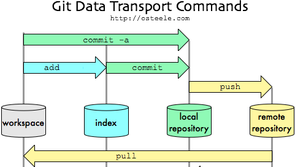
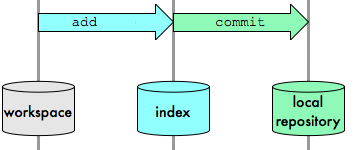
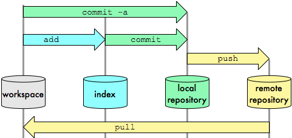

!SLIDE subsection

# git recapitulation

!SLIDE 

# Where?

!SLIDE incremental
# Configure Git

* command "git config"
* for project: stored in .git/config
* for user: is stored in ~/.gitconfig
* use flag --global for user

!SLIDE smaller
#Configure

        @@@ sh
        $ git config --global user.name "Firstname Lastname"
        $ git config --global user.email "me@fh-salzburg.ac.at"
        $ git config --list --global
        # user.name=Firstname Lastname
        # user.email=me@fh-salzburg.ac.at

!SLIDE smaller
# Create Repository from scratch

        @@@ sh
        cd project_directory
        git init
        # creates subdirectory .git
        # repository is stored in there
        # .git/config 

!SLIDE smaller
# Windows Only: line breaks?

Some configs you might want to set

        @@@ sh
        core.autocrlf false
        core.editor "C:/Programme/Notepad++/Notepad++.exe"

!SLIDE smaller
## Aliases

        @@@ sh
        git config --global alias.co checkout

        # you now can use
        git co master
        # instead of
        git checkout master

!SLIDE
# Plain git Workflow

!SLIDE

        @@@ sh
        # what's up?
        git status

        # i've edited a file
        git add FILE

        # i've edited a lot of files
        git add .

        git commit -m "describe the commit"

!SLIDE
# Index / Staging area

Workspace ("working copy") is managed by git!

!SLIDE

# content, not file!

        @@@ sh
        # change file
        git add file
        # change file again
        git status
        git diff
        git diff --staged 

*the first change has beed staged, but not the second!*

!SLIDE
# delete file

* deleting file from workspace alone is not enough
* opposite of "git add" is "git rm"

        @@@ sh
        git rm FILE

!SLIDE
# rename file

        @@@ sh
        git mv SOURCE DESTINATION

!SLIDE
# remotes

!SLIDE
# clone an existing repository

        @@@ sh
        git clone REPOSITORY_URL
        git clone REPOSITORY_URL DIR_NAME

* implicitly sets
  
        @@@ sh
        git remote add origin REPOSITORY_URL

!SLIDE smaller
# add a remote 

        @@@ sh
        git remote add REMOTE_NAME REMOTE_URL
        
        git remote add origin ssh://repos.mediacube.at/opt/git/username.git
        git remote add github git@github.com:bjelline/web-engineering-textbook.git

!SLIDE
# workflow with remote

!SLIDE
# push

* specify local branch and remote repository

        @@@ sh
        git push origin master

!SLIDE
# pull

* specify local branch and remote repository

        @@@ sh
        git pull origin master

